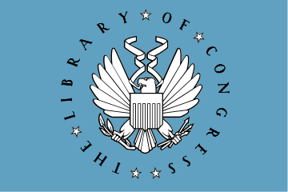

___________________
{width=20px}
{width=30px style="float: right;"}
{width=30px style="float: right;"}
{width=30px style="float: right;"}

___________________
:::: {style="background-color:#F8F9FA; margin: 5px"}

This article is about the United States Library of Congress. For other uses, see $\color{blue}{\text{Library of Congress (disambiguation).}}$

:::: 

:::: {}
The **Library of Congress (LC)** is the research $\color{blue}{\text{library}}$ that officially serves the $\color{blue}{\text{United States Congress}}$ and is the $\color{blue}{de facto}$ national library of the United States. It is the oldest federal cultural institution in the United States. The library is housed in three buildings on Capitol Hill in Washington, D.C.; it also maintains the National Audio-Visual Conservation Center in Culpeper, Virginia.[1] The library's functions are overseen by the librarian of Congress, and its buildings are maintained by the architect of the Capitol. The Library of Congress is one of the largest libraries in the world. Its "collections are universal, not limited by subject, format, or national boundary, and include research materials from all parts of the world and in more than 450 languages."

:::: 

:::: {style="display: grid; grid-template-columns: 3fr 1fr; grid-column-gap: 10px;"}

:::: {style="display: grid; grid-column-start: 1"}

Congress moved to Washington, D.C., in 1800 after sitting for 11 years in the temporary national capitals in New York City and Philadelphia. In both cities, members of the U.S. Congress had access to the sizable collections of the New York Society Library and the Library Company of Philadelphia. The small Congressional Library was housed in the United States Capitol for most of the 19th century until the early 1890s. Most of the original collection had been destroyed by the British in 1814 during the War of 1812, and the library sought to restore its collection in 1815. They bought Thomas Jefferson's entire personal collection of 6,487 books. After a period of slow growth, another fire struck the library in its Capitol chambers in 1851, again destroying a large amount of the collection, including many of Jefferson's books. After the American Civil War, the Library of Congress grew rapidly in both size and importance, which sparked a campaign to purchase replacement copies for volumes that had been burned. The library received the right of transference of all copyrighted works to deposit two copies of books, maps, illustrations, and diagrams printed in the United States. It also began to build its collections, and its development culminated between 1888 and 1894 with the construction of a separate, extensive library building across the street from the Capitol.

The library's primary mission is to research inquiries made by members of Congress, carried out through the Congressional Research Service. The library is open to the public, although only high-ranking government officials and library employees may check out books and materials.

:::: 

:::: {style="display: grid; grid-column-start: 2"}
::::{style="background-color:#F8F9FA; margin: 5px; padding: 10px"}

:::: 
::::

::::